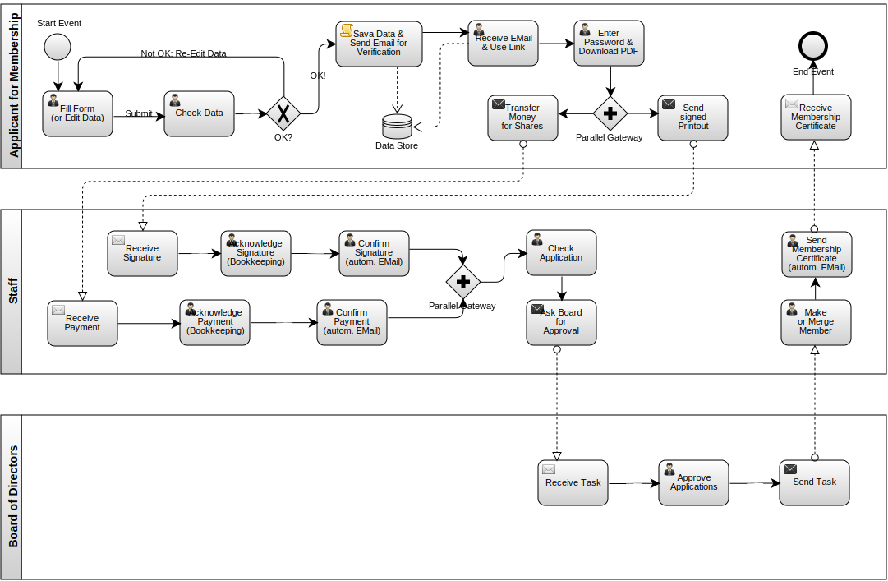

========
Overview
========

From Application to Membership
------------------------------

Users coming to the app see the form to become a member
(Application for Membership).

.. note:: This will be changed in future versions.
          There will be a start page with links to join forms
          for both persons and legal entities,
          as well as to a login form.

They supply information, confirm it (or re-edit if necessary)
and  have an email sent to them.

A link in that email helps to verify their email address,
then they may download a PDF to sign and send back to headquarters.

On the second page of the printout (like in that EMail)
they find information on where to transfer the money
for the shares.

..   :height: 100px
..   :width: 200 px
..   :scale: 50 %

Upon arrival at C3S headquarters, signature and payment are
acknowledged. EMail receipts are sent out in both cases.

Once both have arrived, the board of directors can
approve the new member.

After approval, the application is turned into a membership
(or the additionally acquired shares are attributed
to the original membership), and a membership certificate
(or update thereof) can be sent to the member.

The relevant documentation (generated from the code)
can be found here: :ref:`code_docs_afm`.

Staff Login and Dashboard
-------------------------

Staff can use their existing login to maintain memberships and applications.

The applications for membership are all listed on the dashboard.

There is an alternative listing for complete (/approved) members.

.. graphviz::

   digraph foo {
      rankdir=LR;
      "yes.c3s.cc/login" -> "dashboard (upcoming members)";
      "dashboard (upcoming members)" -> "memberships (actual memberships)";
   }

See the code docs here: :ref:`code_docs_accountants`.

Autodocumenting Code
--------------------

The modules and view functions carry docstrings
(descriptions of what the code does).
Check out the listing in the next section: :ref:`sec_code`.

More Overview
-------------

.. toctree::
   :caption: Table of Contents
   :maxdepth: 2
   
   All Routes <routes>

